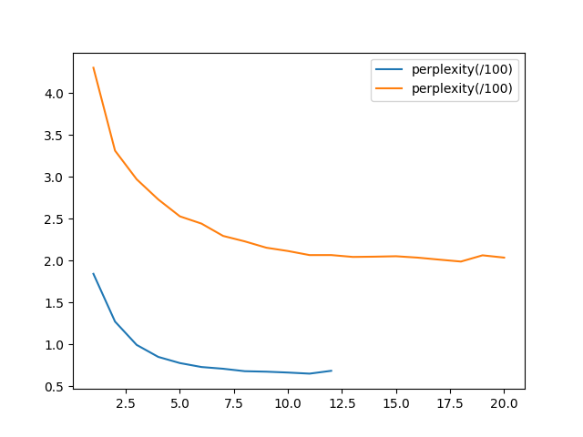

# report
## Text Generation
### LSTM LM
`好--> <s>好风吹雨过西湖|一夜寒灯照酒壶|今日重来无一事|不知何处是吾庐</s>`

This is the training curve. The x axis is the training epochs. (The same for other graphs.)


(The discontinuity of the graph is due to hyper-parameter tuning during the training process.)

### LSTM Seq2Seq
`改革春风吹满地--> <s>和谐社会暖千家</s>`


### Transformer LM
`好--> <s>好风吹雨过重阳|一夜扁舟泊渺茫|不是故人相忆处|故园春色满潇湘</s>`


### Transformer Seq2Seq
`改革春风吹满地--> <s>文明时雨润全城</s>`


### Ablation study of attention mechanism in LSTM Seq2Seq

In each the graph, the orange denotes the model with ablation.

The perplexity plot is shown as



The training and valid loss curve is shown as:


From the plot we can see that both the convergence rate and the final performance is influenced without the attention mechanism.

## Reading Comprehension

In the task, I directly use the code of the demo lora finetuning for the MiniCPM model. The code can be found in the `classification` folder. To mimic the style of the demo provided by the MiniCPM model repository, I use the following prompt: (which can be found in `model.py`)

```python
inputs = f"""文段#{text}*句子个数#共{cnt_sentence(text)}句话*题目#{(kwargs['questions'][i])}*选项#{format_choices(kwargs['choices'][i])}""" 
```

Here, `cnt_sentence` function is used to count the number of sentences for the model, since it can't perform well on the task. `format_choices` make the choices in a cleaner format.

The hyperparameters can be found in `finetune.sh`:

| Hyperparameter | Value |
| -------------- | ----- |
| batch size    | 1     |
| learning rate | 5e-5  |
| max length    | 1500   |
| max steps     | 4000  |
| gradient accumulation steps | 4 |
| warmup steps  | 100  |
| weight decay  | 0.01  |

*Side Note*. The finetune code can't directly be run now since the `config` folder is removed finally for simplicity. It can be directly found in the `finetune` folder in the `MiniCPM` repository on github (I haven't change the config file). 

The only trick I used is the prompt formatting shown above, especially the counting of the sentence, which helps a lot. The dataset is also transformed before training, for which the process can be found at `format_dataset.py`. An example output data is shown as below

```json
{
    "messages": [
        {
            "role": "user",
            "content": "文段#蜡烛里的秘密①我是前段时间来到石板镇的。小镇老是停电，得准备蜡烛。②我一连找了三家杂货铺，店主都同样告诉我:“没有。”我很纳闷，一个镇子，怎么连卖蜡烛的都没有?③小镇上有四间杂货铺，我打算到剩余的那家去碰碰运气。店主看出我是新来的，直截了当告诉我:“你到街尾的老阿婆家去买吧，她那儿有。”这让我更奇怪了，老板怎么会知道老阿婆家卖蜡烛?④于是，我顺着石板街一直走。走到尾，在一个缩进去的地方，吴然有一个简陋的摊位，几块砖头和破木板搭的货架上摆着香纸和蜡烛。付钱的时候，我问老阿婆:“生意好吗?”老阿婆笑呵呵地说:“好，这不老停电吗?来我这买蜡烛的人多。不过老停电，也不好哟……”她抬起胳膊，把蜡烛递给我。我这才发现，老阿婆的腿不能动，估计是下半身瘫痪。我冲她笑了笑，满意而归。⑤接连几个晚上还是停电，我到街上漫步。走着走着，我来到一家杂货铺，买了点东西，又跟老板闲聊起来。我好奇地问:“小镇老是停电，蜡烛生意应该很好，你为什么不进些蜡烛卖呢?”⑥店主笑了笑，这才告诉我秘密。原来，老阿婆的日子过得很艰难，他们几家杂货铺商议之后，偷偷有了一个约定:不卖蜡烛。⑦听了店主的话，我被深深地感动了。*句子个数#共16句话*题目#“听了店主的话，我被深深地感动了。”感动“我”的是*选项#A. 老阿婆身体残疾，却还自食其力。|B. 三家杂货铺都不卖蜡烛,“我”在第四家买到了。|C. 四家店铺老板同情老阿婆，从他们约定不卖蜡烛的行为可以看出他们善良的心|D. “我”终于知道了蜡烛里的秘密。"
        },
        {
            "role": "assistant",
            "content": "C"
        }
    ]
}
```

The training curve can be shown below.


Notice that the epoch is shown as decimals, since the training is done in unit of steps, instead of epochs. Moreover, the code provided by the MiniCPM model repository lead to a `nan` validation loss, and I can't figure out the reason.